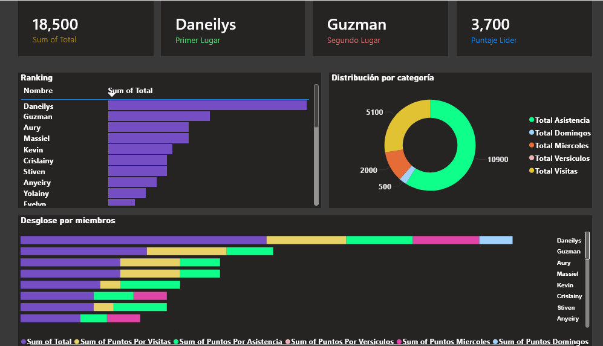
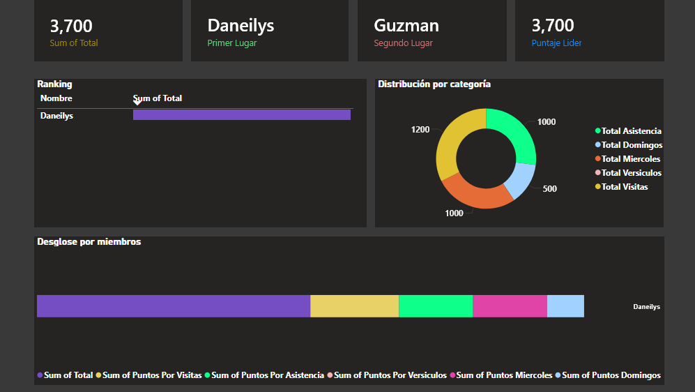
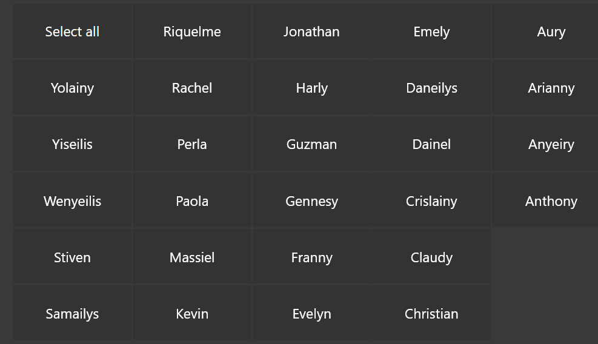

# Dashboard de Ranking – Club Bíblico

Dashboard interactivo desarrollado en Power BI para gestionar
y visualizar el desempeño de los jóvenes del Club Bíblico,
permitiendo a los líderes hacer seguimiento en tiempo real.
##

## Dashboard Principal

## Dashboard Descripcion De Los Participantes

## Menu Interactivo De Jovenes

## ¿Qué muestra?

- **Ranking general** — clasificación de todos los jóvenes por puntos acumulados
- **Puntos por asistencia** — domingos, viernes y miércoles
- **Puntos por visitas** — llevar visitantes a la iglesia
- **Puntos por versículos** — recitación de memoria
- **Panel de jugador** — botones por nombre para ver métricas individuales

## Visualizaciones

- Gráfico de barras apiladas
- Gráfico de anillo (donut) por categoría de puntos
- Tabla de ranking con posiciones
- Tarjetas Descriptivas
- Segmentacion De Datos

## Herramientas

Power BI · DAX · Modelado de datos
